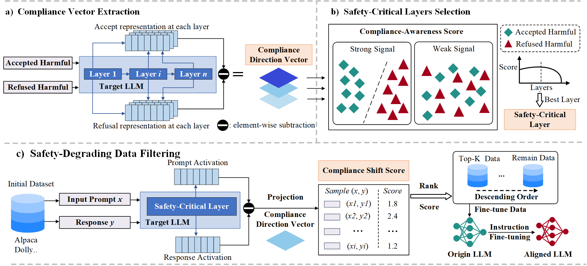

# DataShield: Safety-degrading Data Filtering for LLM Benign Instruction Fine-Tuning

Code for the paper [DataShield: Safety-degrading Data Filtering for LLM Benign Instruction Fine-Tuning](https://arxiv.org/abs/2606.00160).




**Figure.** *The overall architecture of the DataShield framework. It consists of three main phases: (a) extracting the compliance direction vector via paired response activations; (b) identifying safety-critical layers using the compliance-aware score (CAS); and (c) computing the compliance shift score (CSS) to filter out potentially harmful training samples before fine-tuning.*


## 🛡️ Overview

Large language models (LLMs) suffer from degraded safety capabilities even when fine-tuned with benign datasets. 
However, existing methods for identifying safetydegrading
samples in benign datasets suffer from high computational
costs and significant noise issues. In this paper, we propose
DataShield to efficiently and effectively identify potential safetydegrading
samples. Our key intuition is based on the observation
that benign fine-tuning increases the overall response compliance
of LLMs.

## ⚙️ Installation


1. Clone the repository:
    ```bash
    git clone https://github.com/ZJunBo/DataShield.git
    cd DataShield
    ```

2. Install dependencies:
    ```bash
    conda create --name DataShield python=3.10
    conda activate DataShield
    pip install -r requirements.txt
    ```
You need to download Llama3-8B-Instruct, Llama3.1-8B-Instruct, Qwen2.5-7B-Instruct, and Llama Guard 3 to a local folder. 
Please make sure to correctly set the corresponding paths in safe_test.py, alpaca_train.py, dolly_train.py, generate_compliance_vector.sh, and cal_projection.sh.
## 🔍 Data Preparation

1. **Extract the compliance vector.**

   ```bash
   bash generate_compliance_vector.sh
   ```

2. **Select and visualize safety-critical layers.**

   ```bash
   cd datashield/safety_layer_selection
   python main.py
   python vis_3model.py
   ```

3. **Compute projection scores and filter safety-degrading samples.**

   ```bash
   bash cal_projection.sh
   ```


## 🧪 Training and Evaluation：bottom-1000 and top-1000 subset 
train the LLM with alpaca/dolly datasets:
```bash
bash train.sh
```
The shell script will perform training and safety evaluation, and finally generate an attack_success_rate_summary.csv file that records the ASR on different benchmarks.


## 🙏 Acknowledgements


We would like to acknowledge [LARF](https://github.com/LLLeoLi/LARF), as part of our code was adapted from their work.

## 📚 Citation

If you find this code useful, please consider citing:

```
@misc{zhang2026datashieldsafetydegradingdatafiltering,
      title={DataShield: Safety-degrading Data Filtering for LLM Benign Instruction Fine-Tuning}, 
      author={Junbo Zhang and Qianli Zhou and Xinyang Deng and Wen Jiang and Jie Pan and Jinbiao Zhu},
      year={2026},
      eprint={2606.00160},
      archivePrefix={arXiv},
      primaryClass={cs.CR},
      url={https://arxiv.org/abs/2606.00160}, 
}
```

## 📬 Contact

If you have any questions or need further assistance, please feel free to [contact me](mailto:zjb99@mail.nwpu.edu.cn).
